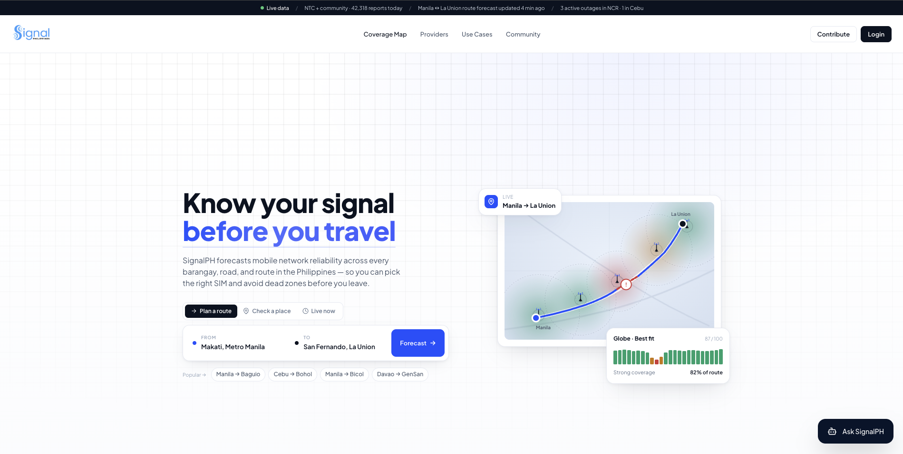

# Signal PH

Signal PH is a cellular coverage intelligence platform for the Philippines. It forecasts coverage along routes, compares providers, highlights weak-signal areas, and recommends a better SIM for a trip.




## Features

- Route and point coverage analysis
- Globe, Smart, and DITO comparison
- SIM/provider recommendations
- Weak-signal and dead-zone detection
- Interactive tower and coverage maps
- Crowdsourced reports and offline-readiness guidance
- AI chat assistant

## How it works

1. The user selects a place or route.
2. The frontend sends the request to FastAPI.
3. The backend combines route, tower, and community-report data.
4. Coverage is scored and weak areas are identified.
5. The frontend displays provider rankings, coverage gaps, and recommendations.

## Architecture

```
React + Vite frontend
        ↓
FastAPI + MCP analysis API
        ↓
Tower matching and provider scoring
        ↓
Supabase/PostgreSQL + OSRM + OpenCellID
        ↓
Coverage results returned to the frontend
```

## Tech stack

| Area | Core technologies |
| --- | --- |
| Frontend | React, TypeScript, Vite, Tailwind CSS |
| Maps | Leaflet, React Leaflet, Deck.gl |
| Backend | Python, FastAPI, Uvicorn, Pydantic |
| Data | Supabase PostgreSQL, OpenCellID |
| AI | Wllama browser inference, local LFM model |
| Integrations | MCP, OSRM, optional Google Maps Platform |

## Project structure

```
.
├── frontend/   # React interface, maps, chatbot, and orchestration
└── backend/    # FastAPI API, scoring, agents, database, and MCP tools
```

## Getting started

### Prerequisites

- Python 3.13+
- Node.js and npm
- Supabase project or compatible PostgreSQL database
- Optional: OpenCellID and Google Maps API keys
- Optional: local LFM server, unless using the browser model

### Backend

```bash
cd backend
python -m venv .venv
source .venv/bin/activate
pip install -r requirements.txt
```

Create `backend/.env` with the required database settings. The backend defaults to port `8001`.

```bash
python -m backend.main
```

API documentation:

- http://localhost:8001/docs
- http://localhost:8001/redoc
- http://localhost:8001/health

### Frontend

```bash
cd frontend
npm install
npm run dev
```

The Vite development server normally runs at http://localhost:5173.

Useful frontend environment variables:

```env
VITE_API_URL=http://localhost:8001
VITE_SIGNALPH_API_BASE_URL=http://localhost:8001
VITE_LFM_MODE=browser
VITE_LFM_MODEL_URL=/model/LFM2.5-350M.i1-Q6_K.gguf
```

For a server-hosted LFM, set `VITE_LFM_MODE=server`, `VITE_LFM_BASE_URL`, and `VITE_LFM_MODEL_NAME`.
